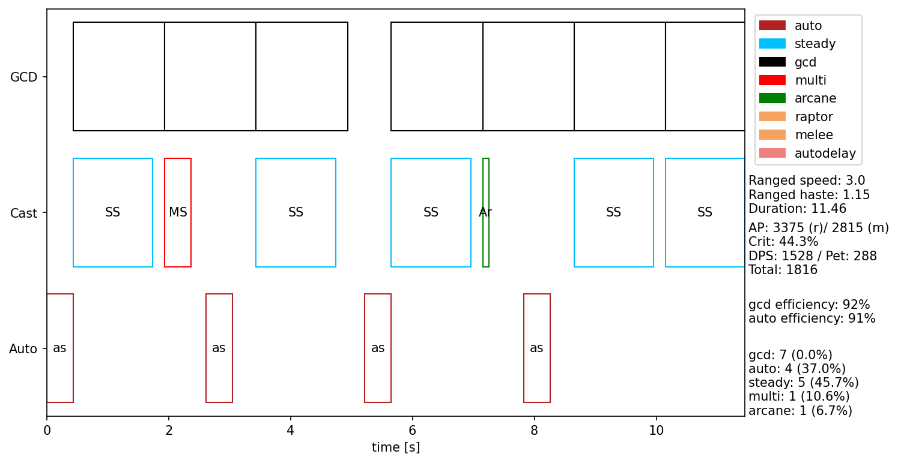
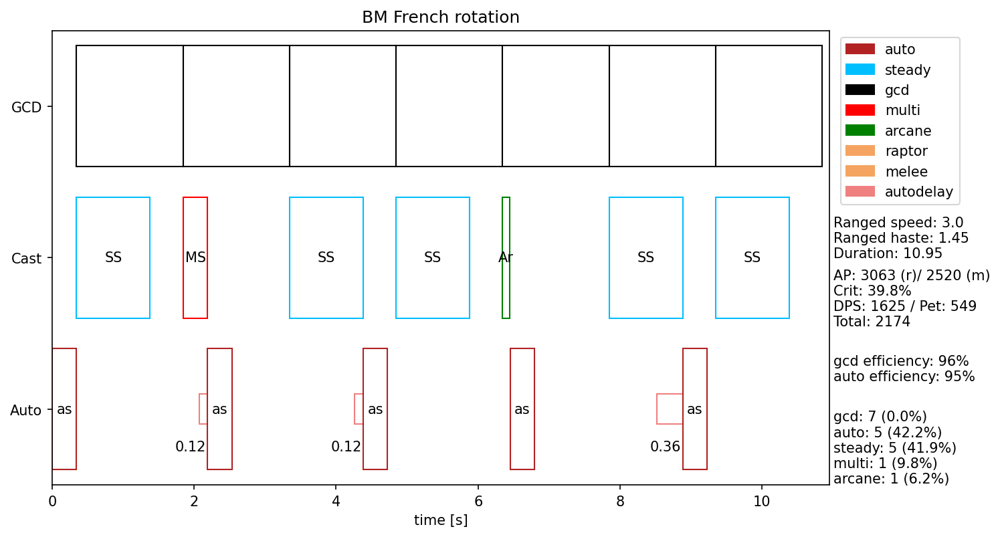
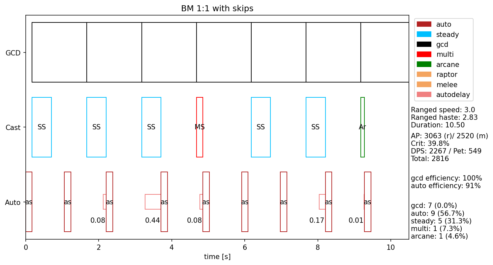
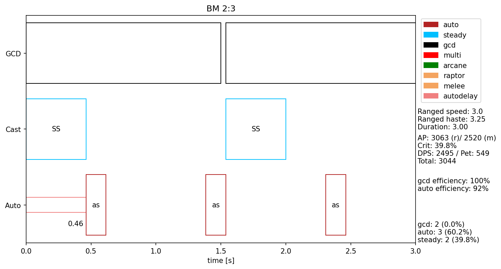
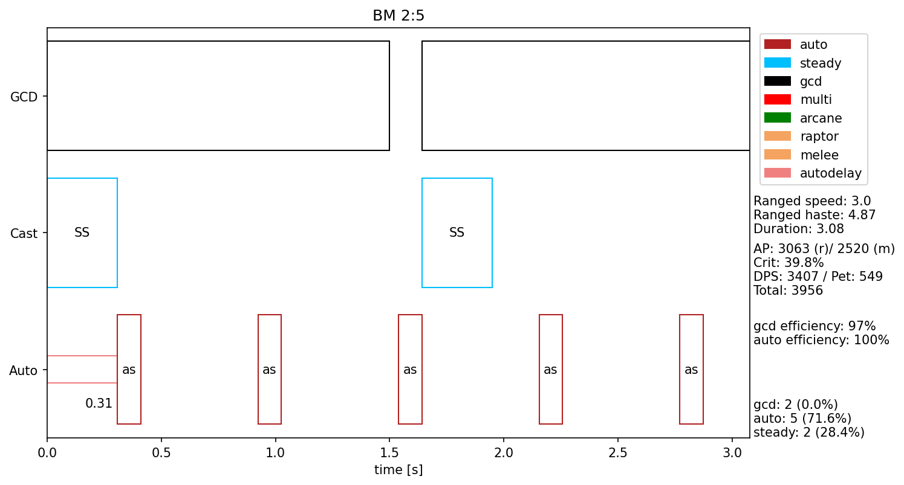

# Hunter rotations and haste

In TBC, hunters will be running different rotations based on their current haste level or effective weapon swing. There are different concepts to visualize this: While the most frequently encountered notation is that of effective weapon swing (eWS) which can also be observed intuitively, using the total haste can be advantageous in some situations.

## Static haste

In early TBC, there will be no static haste on gear. Our only source for haste are 15% from quiver and possibly 20% from the BM talent Serpent's Swiftness. Thus, survival hunters start at 15% total haste, which means that they get 15% additional attack during a particular time. Their eWS is

```
eWS = WS / 1.15
```

as this is how haste is applied in World of Warcraft.

For BM hunters, the two sources of haste apply multiplicatively, so their eWS is

```
eWS = WS / 1.15 / 1.2 = eWS / 1.38
```

In both cases, `WS` is the original weapon swing time as given in the weapons tooltip.

In most of TBC, hunters will be using weapons with 3.0 tooltip speed. The only exception is P1, where the best weapon (Sunfury Bow of the Phoenix off of Prince Malchezaar) has a 2.9 speed. The best preraid weapon, Wrathtide Longbow, also has a 3.0 speed as most later weapons.

## Changing rotations

During a fight, TBC hunters use different rotations depending on their current haste value or effective weapon swing. Stacking all available haste effects, hunter can achieve 3.36 additional haste for a total of 4.64 with BM talents. This pushes the eWS down to 0.62 seconds. This relies on having improved Aspect of the Hawk and the proc of Dragon Spine Trophy up during your own stacked haste effects from Bloodlust, Rapid Fire, Drums of Battle and Haste Potion. This can only happen for a maximum of 10 seconds (shortest duration of these effects) every 10 minutes (longest cd of these effects), but we will be doing huge dps during this time.

Most of the time, we will have much lower haste. This is okay, we can still do top notch dps without this excessive stacking.

Here is an overview of available rotations - which will be explained further on - and their relative dps at different haste levels:


Drums of battle are only included when a haste potion is used to illustrate the highest levels of haste achievable in phase 1. When using drums of battle at all times in our group, all of the lower haste points move slightly to the right, increasing our dps. This does not change the rotation we should use at any of these common haste points.

For survival hunters, the graph looks slightly different due to lower base haste, and as a result the effective weapon swing is always slower:


Depending on the phase and current gear, as a survival hunter we may or may not be specced into improved aspect of the hawk, thus this effect may not apply at all.

## Rotation details

### Basic rotations

All basic rotations use only steady shot for illustration purposes, but in practice should use multi shot instead of a steady shot whenever it is off CD to slightly improve dps.

###### 2:1

Casting two steady shots and one auto shot alternatingly. This is lower dps than the complex rotation for any level of haste, and shouldn't be used. Ever.

Because we don't use, we don't have to draw it either.

###### 1:1


This is the most simple rotation possible and can be achieved by using a macro of the form

```
/castsequence !Auto shot, Steady shot
```

This rotation is used at effective weapon swings from 1.3 to 1.6 seconds, where the GCD and auto shot swing line up almost exactly.

###### 1:2


At high enough haste, we can let two auto shots through during the GCD of one steady shot.

###### 1:3


At even more haste, we can let a third auto shot through between casting steadies. Sadly, these levels are out of reach an phase 1, and can only be reached with static haste gear in later phases.

### Complex rotations

###### The short French rotation (5:4:1:1)



This only ever appears for survival hunters without the 20% haste out of the BM talent tree.

###### The French rotation (5:5:1:1)



The standard rotation for BM hunters and survival hunter with improved Aspect of the Hawk or DST procs active. Compared to the 1:1 rotation, it slightly delays the auto shots to fit additional shots in. The additional shots are only multi and arcane shots due to their lower cast time.

###### The long French rotation (5:6:1:1)


A slight dps increase over the standard French rotation with Aspect of the Hawk proc for BM hunters is using multi and arcane together to fit just one additional shot in between your autos, instead of the two additional shot of the standard French rotation.

###### The skipping rotation (5:9:1:1)



This is a variant of the 1:1 rotation that uses the shorter cast time of multi and arcane shot to let another auto shot through with each of these casts, resulting in 7 casts for every 9 auto shots. This is used for BM hunters with Rapid fire and Hawk proc or Rapid fire and Bloodlust up (shown here).

### Combined rotations

Like the basic rotations, the illustrations here use only steady shots, that should be replaced with multi shots whenever possible.

###### 2:3



This rotation alternates cycles of 1:1 and 1:2 to better match GCD and weapon swing.

###### 2:5



This combines cycles of 1:2 and 1:3 at very high haste - for phase 1, this requires having improved Aspect of the Hawk *and* DST procs during Bloodlust, Rapid fire, drums and haste potion.

### Acknowledgement

This overview would have been impossible to complete without others, especially on the [Classic & TBC Hunter Discord](https://discord.gg/8TVHxRr). In no particular order, thanks go out to Aegaegh, Chitzen, Kanja, Tragnar, and Bouk who has gone missing recently.

